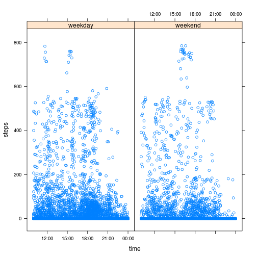

## Loading and preprocessing the data


1) Unzip and read activity data in one step.


```r
data <- read.csv(unz("activity.zip", "activity.csv"))
```

2) Convert date and interval to a date.

```r
data$date <- as.POSIXct(strptime(paste(data$date, data$interval), '%Y-%m-%d %H%M'))
```

Convert just the interval to a time.

```r
data$time <- as.POSIXct(strptime(data$interval, '%H%M'))
```

Aggregated the steps over days:

```r
data.byday <- aggregate(data$steps, by=list(data$date), sum, na.rm = TRUE)
names(data.byday) <- c('day', 'steps')
```

Aggregated the steps by weekday:

```r
data.byweekday <- aggregate(data$steps, by=list(data$weekday), sum, na.rm = TRUE)
```

```
## Error: arguments must have same length
```

```r
names(data.byweekday) <- c('weekday', 'steps')
levels(data.byweekday$weekday) <- c('Mon', 'Tue', 'Wed', 'Thu', 'Fri', 'Sat', 'Sun')
```

Aggregate the steps by time.


```r
data.bytime.mean <- aggregate(x = data$steps,
                              by = list(data$time),
                              FUN = mean,
                              na.rm = TRUE)
names(data.bytime.mean) <- c('time', 'steps')
```

## What is mean total number of steps taken per day?

1) Histogram of the number of steps per day


```r
plot(data.byday$day, data.byday$steps, type='l',
     xlab='day', ylab='steps')
```

 

2) Calculate the mean,


```r
mean(data.byday$steps, na.rm = TRUE)
```

```
## [1] 34.05
```

and median

```r
median(data.byday$steps, na.rm = TRUE)
```

```
## [1] 0
```

## What is the average daily activity pattern?

1) Make a time series plot.

```r
plot(data.bytime.mean$time, data.bytime.mean$steps, type='l',
     xlab='time', ylab='steps')
```

 

2) 5-minute interval when we have the most steps.


```r
t <- data.bytime.mean$time[which.max(data.bytime.mean$steps)]
format(t, "%H:%M")
```

```
## [1] "15:50"
```

## Imputing missing values

1) Total number of missing values:


```r
sum(is.na(data$steps))
```

```
## [1] 2304
```

2) Use the average to fill in the values.


```r
avg <- mean(data.filled$steps, na.rm = TRUE)
```

3) Create a new dataset with data filled in.

First copy the data.

```r
data.filled <- data
```

Where there's no data, put in the average.

```r
data.filled$steps <- ifelse(is.na(data.filled$steps), avg, data.filled$steps)
```

4) Calculate the new mean and meadian.

```r
mean(data.filled$steps)
```

```
## [1] 37.38
```

```r
median(data.filled$steps)
```

```
## [1] 0
```
## Are there differences in activity patterns between weekdays and weekends?

1) Create a weeday and weekend factors.

Add weekday column with levels.

```r
data$weekday <- factor(weekdays(data$date, abbreviate = TRUE),
    levels = c('Mon', 'Tue', 'Wed', 'Thu', 'Fri', 'Sat', 'Sun'))
```

Add a weekend column.

```r
data$weekend <- factor(ifelse(data$weekday %in% c('Sat', 'Sun'), 'weekend', 'weekday'))
```

Aggregated by weekend/weekday:

2) Panel plot


```r
xyplot(data$steps ~ data$time | data$weekend,
       xlab='time', ylab='steps')
```

 
